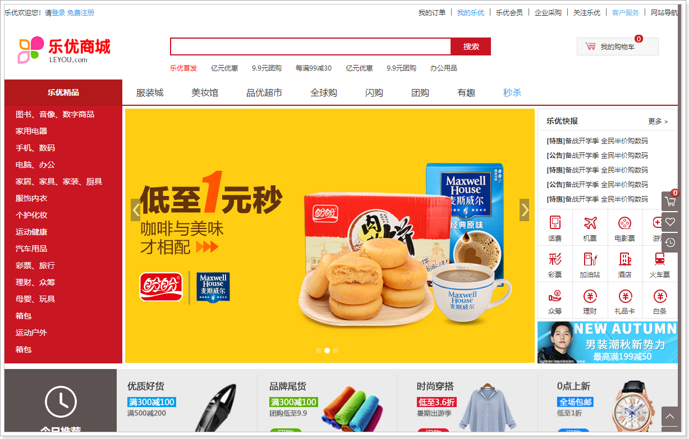
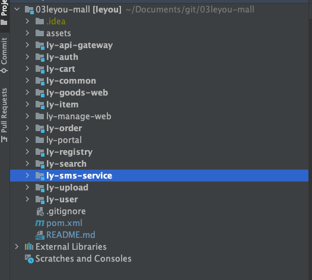

This project comes from the free resources of bilibili IThema Programmer Network.
Function wise, it is similar with JD.com, which is China’s largest online retailer and its biggest overall retailer.
I use this project to practice microservice application.

# Project introduction  
- Leyou Mall is a full-category e-commerce shopping website (B2C).  
- Users can buy products online, add to shopping carts, place orders, and instantly kill products  
- Administrators can manage the removal and sale of products and promotions in the background  
- Admin can monitor product sales status  
- Customer service can process refunds in the background  
- Hope to support tens of millions of users in the next 3 to 5 years  

# System Architecture

## Frontend

  - Management portal: mainly for data management people, using the Vue-based single-page application development method  
   

  - User Portal: facing endusers, the portal uses Vue combined with Nuxt to achieve server-side rendering  
   

## Backend

  Backend adopts the SpringCloud-based microservice architecture, and expose Rest-style interfaces.

   

# Technical selection  

***Frontend Technical stacks***:
- Basic HTML, CSS, JavaScript (based on ES6 standards)  
- Vue.js 2.0 and Vue-based UI framework: Vuetify  
- Front-end build tool: WebPack  
- Front-end installation package tool: NPM  
- Vue scaffolding: Vue-cli  
- Vue routing: vue-router  
- ajax framework: axios  
- Vue-based rich text framework: quill-editor  

***Backend Technical stacks*** 

- SpringMVC, Spring 5.0
- MyBatis3  
- Spring Boot version   
- Spring Cloud
- Redis
- MySQL 
- RabbitMQ 
- Elasticsearch
- nginx 
- FastDFS for distributed file storage
- Thymeleaf  
- JWT
- alibaba Dayu integration for SMS
- WeChat SDK for payment integration

 

